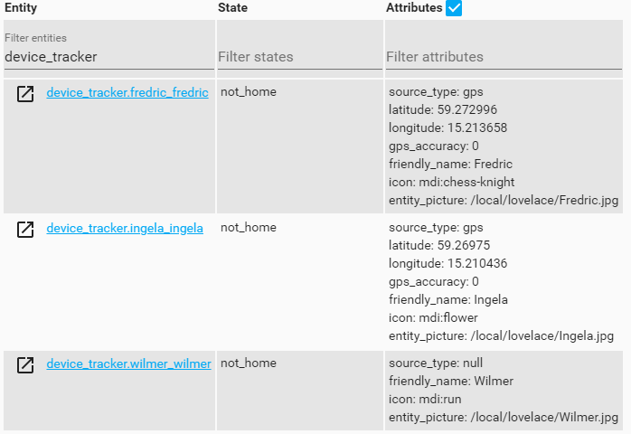
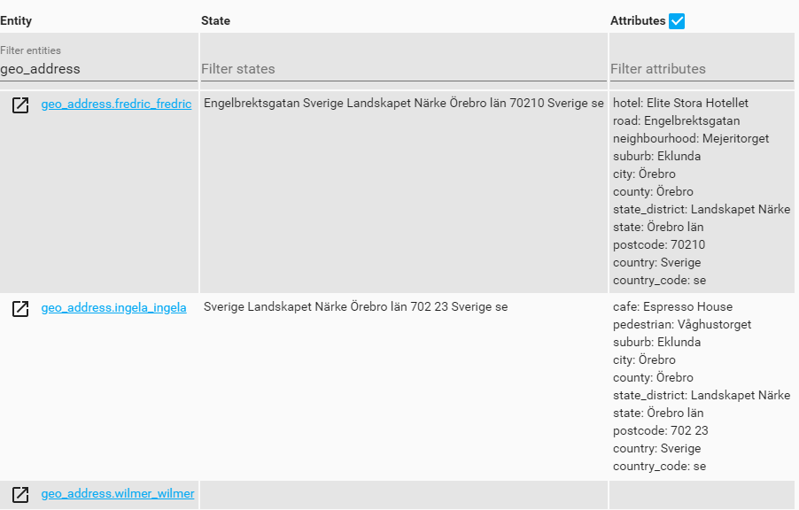
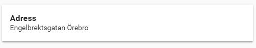

# geo_address
A plugin to automatically lookup address information using device_tracker position.

The plugins will create new state information named after the existing device_trackers in Homeassistant.

The plugin uses device trackers<br/>


...to create address info<br/>


## Usage
Add this to configuration.yaml

```yaml
geo_address:
  update_interval: 60
  update_period: 3600
  use_state: true
```

| property | Example | Result
| ------------ | ------- | ------
| update_interval | `60` | how often to check for new position
| update_period | `3600` | for how long back in time to check for changes
| use_state | `true` | use state change updates


## Implementation
Example implementation in Lovelace. I've used Thomas Lovéns Lovelace module <a href="https://github.com/thomasloven/lovelace-markdown-mod">lovelace-markdown-mod</a> for this. 
```yaml
type: markdown
  content: >
    <h3>Adress</h3>
    [[ geo_address.fredric.attributes.road ]] [[ if(geo_address.fredric.attributes.house_number != undefined, geo_address.fredric.attributes.house_number, "") ]]
    [[ if(geo_address.fredric.attributes.city != undefined, geo_address.fredric.attributes.city, "") ]] 
```



##Example usage

Standard picture entity card and markdown below. 

```yaml
- type: picture-entity
  entity: device_tracker.fredric
  image: /local/lovelace/Fredric.jpg
  show_name: false
  
- type: markdown
  content: >
    <h3>Adress</h3>
    [[ geo_address.fredric.attributes.road ]] [[ if(geo_address.fredric.attributes.house_number != undefined, geo_address.fredric.attributes.house_number, "") ]]
    [[ if(geo_address.fredric.attributes.city != undefined, geo_address.fredric.attributes.city, "") ]]  
```

In the screen dump above. I've used <a href="https://github.com/custom-cards/vertical-stack-in-card">vertical-stack-in-card</a> to be able to make a tighter fit between the the cards.

